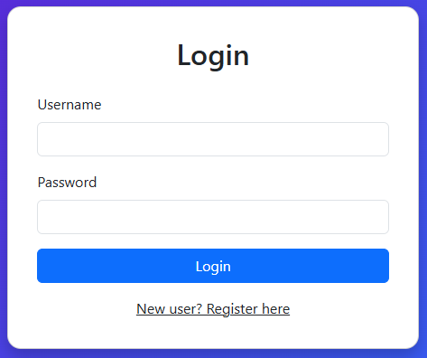
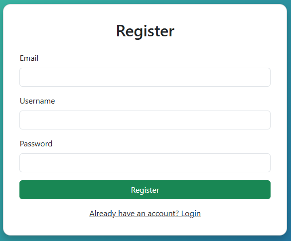
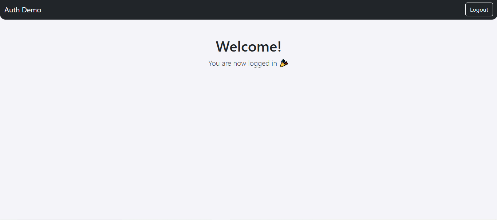

# Auth Demo Spring Boot

## 📌 Description
A simple authentication demo project with **Spring Boot** that allows users to register, log in, and access a protected home page.  
It demonstrates how to integrate **Spring Security** with a MySQL database and Thymeleaf forms (login & register pages).

## ⚙️ Technologies Used
- Java 17  
- Spring Boot 3  
- Spring Security  
- Spring Data JPA & Hibernate  
- MySQL Database  
- Thymeleaf (HTML templates)  
- Bootstrap 5 (UI styling)

- ## 🚀 Features
- User Registration with encrypted passwords  
- User Login with session management  
- Logout functionality  
- Protected home page (accessible only after login)  
- Modern UI with Bootstrap & custom styling

- ## 📸 Screenshots
### 🔑 Login Page

### 📝 Register Page

### 🏠 Home Page

